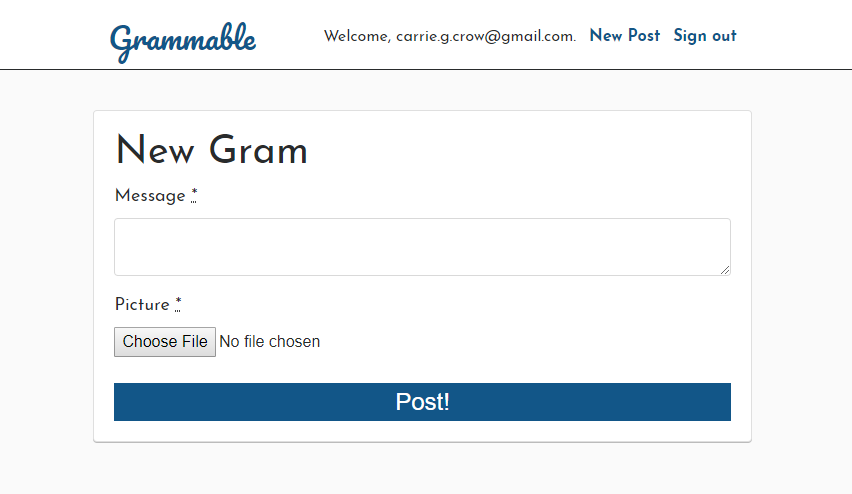
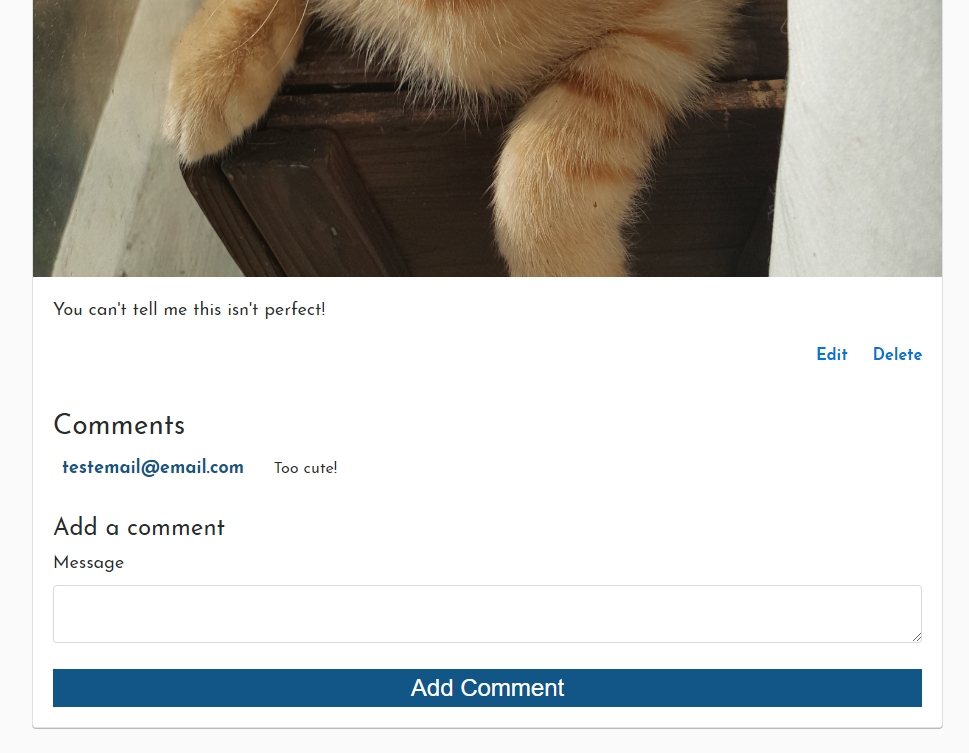

# Grammable

Grammable allows users to log in, upload photos to share, and comment on others photos.

This application was created as part of the University of Wisconsin Extension Bootcamp.

## User Stories

As an anonymous user, I want to:
  * See grams uploaded by other users, so I can enjoy the content
  * See comments uploaded by other users, so I can feel part of the community

As an authenticated user, I want to:
  * Create a gram on the site so that I can share my photos
  * Update the messages to my photos so I can make them accurate
  * Add comments to grams created by others so that I can share my opinion
  * Remove grams and comments, if I no longer want them to appear online

## How to run the application:

### Production
Navigate to the production location of [Grammable](https://grammable-carrie-crow.herokuapp.com/)
1. To sign up, sign in, or log out, use the hyperlinks in the navigation bar.
2. To see a list of available photos, simply scroll down on the root page:
  
3. To post a photo, select "New Post" in the navigation bar:
  
4. To add a comment to an existing photo, type your comment into the "Message" text box below the photo, and select "Add Comment":
  

## High Level Organization
Grammable includes two classes for "grams," which are uploaded images, and "comments" Users are managed through the Devise gem. There are only 3 web pages in the application:
* A list of all grams
* Creating a gram
* Editing a gram

### Application specs
Grammable is a Ruby on Rails application, with a database is managed by PostgreSQL
* Rails v. 5.2.3
* Ruby v. 2.5.3

### Integrations Used

The following gems support Grammable's functionality:
* Devise, for user authentication
* RSpec and FactoryBot, for testing
* Figaro, for controlling environment variables
* Carrierwave, for photo upload
* Amazon Web Services, for photo storage in production
* fog-aws, for storing photos on Amazon Web Services
* Bootstrap, for page layout